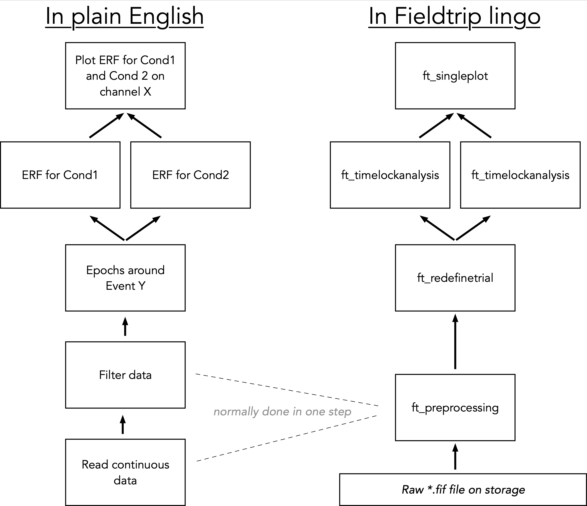

[TOC]

# Basic Fieldtrip Philosophy

As stated previously is a collection of functions for signal processing or statistical analysis of electrophysiological data. These functions are called from the command line or from custom-made scripts / functions. Almost nothing relies on GUIs, which I personally find to be an advantage. But if you are a GUI person, then turn to other options (e.g. SPM; the M/EEG part actually relies quite a lot on Fieldtrip). Most fieldtrip functions start with a "ft_" prefix, thereby avoiding conflicts with other toolboxes that use identical function names (e.g. "topoplot.m" was also used by EEGLAB). Following the prefix, usually is a term that describes what the function does (e.g. "ft_topoplot.m" would plot a topography). Generally you don't have to be a coding genius to set up easy (standard) analysis pipelines, which is fascilitated by the fact that almost all Fieldtrip functions have a common structure, making code usually quite human-readable.

> dataout = ft_dostuff(cfg, datain);
>
> or
>
> dataout = ft_dostuff(cfg);

A crucial and neat element is the "cfg"-bit which is a Matlab-stucture containing the configuration options for the function call. 

> cfg = [];
>
> dataout = ft_dostuff(cfg, datain);

Passing an empty cfg-structure would just use the default settings.

> cfg = [];
>
> cfg.option1 = 'yes';
>
> cfg.option2 = 30;
>
> dataout = ft_dostuff(cfg, datain);

Having the configuration settings visible helps also others to understand what you did and also makes it easier to identify where to make modifications when e.g. nasty reviewers request changes to your analysis (sometimes it is just setting a cfg-option to a different value and just rerunning everything on the cluster). **Make sure to set your cfg to be empty (=[]) when calling a new function.**

Normally (at least the high-level ones) Fieldtrip functions work on specific data-strutures which we will encounter more concretely later. The main data structures are:

* *Preprocessing*: Contains either continuous or epoched raw data.
* *Timelock*: Contains evoked responses.
* *Freq*: Contains output following spectral analysis.
* *Source*: Contains output following source analysis.

# Make a "pipeline" and translate it into Fieldtrip steps

Whatever you do, don't just start with a blind analysis. Have a clear idea what you want to know from your data. A good approach is to **start with an idealized iconic figure that would support / resolve your main research question and reverse engineer the necessary analysis steps**. For example I want to show that the evoked response for two conditions is different on certain sensors. Start with a boxes and arrows chart and work your way backward:

As you can see, most standard analysis steps can be easily mapped in a straight-forward manner from "plain English" into "Fieltrip-lingo".

# Our usual first step

Most experiments using a standard setup, e.g. without bringing in devices that inject extreme artefacts (such as extreme jumps or saturation of channels) into the data can be quite effectively preprocessed using a 2-step approach (described in more detail later): 

1. Remove / reduce artefacts of "external" origin using Maxfilter. 
2. Remove / reduce artefacts of "internal" origin (e.g. blinks) using ICA. 

The advantage of this approach is that:

* User interaction is not zero, but quite minimal.
* For most experiments you keep **all** trials.

# What we want to do

This tutorial implements what I would call a *standard analysis pipeline*. This means nothing fancy or crazy, but steps that are good enough to address many research questions. Also, when you are doing the fanciest analysis the temptation is to skip these "basic" things. However, it is important to check whether you see e.g. evoked responses when they are supposed to be there also with a meaningful topography. If you intend to doing analysis in source space, it is good practice to see whether your favorite inverse solution approach places activity where it should be. **I.e. whenver possible add possibilities to sanity check your data and use a standard analysis pipeline to do so**.

- Preprocessing ICA ... RESTING STATE
- Epoch data experiment
- timelockanalysis
- spectral analaysis
- 1 beamformer + virtual channel reconstruction

Now you can move on to the [description of the experiment](02_The_Experiment.md)

