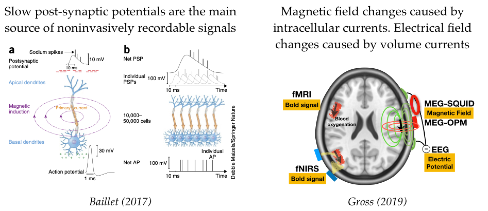

# Welcome to the MEG Analysis Introductory course

[TOC]

This course aims to get teach you some of the most basic steps in MEG analysis. Since the data is very similar and analysis diverges only at very few points what you will learn will also be applicable to EEG analysis. By this point I will assume that you have at least some basic knowledge (ADD A LINK??) about M/EEG, so that we don't need to invest too much time beyond some short reminders. While some coding experience with Matlab would make you more comfortable right from the start, we are not implementing any rocket science. So don't worry.

# What are we measuring with M/EEG?

The main source of our noninvasively recorded electrophysiological signals are thought to be ionic currents causing postsynaptic potentials. Action potentials contribute far less to the recorded signal, as their short latencies does not favour signal summation (>10k neurons are required to produce a detectable signal). Although some ultrafast oscillatory activity (>500 Hz) have been reported, but the standard frequency range investigated with M/EEG is usually <100 Hz. 

# Why is this cool?

# Why Fieldtrip?

Fieldtrip is an extensive MATLAB toolbox containing a vast amount of functions for anaylsis of electrophysiological data (human as well as animal). The toolbox was and still is mainly developed at the [Donders Institute](https://www.ru.nl/donders/) (especially Robert Oostenveld and Jan-Mathijs Schoffelen). It was the first open source toolbox with MEG in mind and a large community of researchers still relies a lot on the provided tools. These include some research focus areas of the Donders folks (e.g. oscillations, connectivity etc.) on sensor as well as source level. Obviously, to the advantage of the entire research community, more alternatives are now available, which can be used to achieve similar things. 

Some examples are:

- [EEGLAB](https://sccn.ucsd.edu/eeglab/index.php), a toolbox that has been used heavily by the EEG-folks
- [Brainstorm](https://neuroimage.usc.edu/brainstorm/Introduction)
- [SPM](https://www.fil.ion.ucl.ac.uk/spm/)
- [MNE](https://mne.tools/stable/index.html), which is Python based.

So why still use Fieldtrip? 

... The first obvious answer is: Why not? Personally I am not convinced by _Matlab = commercial = evil_ as a good reason. Software that makes your life easier and keeps you productive can be commerical, i.e. people can make a living of it. You also want to make a living of your work. Furthermore, many universities (such as Salzburg) have a campus license and even so an individual license is ~1-2k € (for the stuff we need). These costs are reasonable when considering the costs for a PhD student (~35k€) or Postdoc (~65k€) that need to be requested from funding agencies.

Leaving ideological reasons aside, obviously basically any analysis can be done e.g. using MNE and some additional Python packages. For my group it is convenient to have the bulk of an analysis implemented in Fieldtrip, as we have relied on it so long and also have so many custom-made functions building up on it. 

> __DON'T REINVENT THE WHEEL!__ is a mantra that I hold up strongly. 

But also if this was not the case (i.e. having the historic overheads), I would not be sure whether to base my main analysis solely e.g. on Python. For example, starting your analysis from Fieldtrip  facilitates using the abundant possibilities offered by other Matlab based toolboxes (e.g. using DCM in SPM). Furthermore, get away from the either-or-mentality and think in a problem solving manner. For example, if you have done most of your analysis in Fieldtrip, but now either need a tool from Python (either as single step or to complete a part of your analysis), then it is easy to either [call Python directly from Matlab](https://www.mathworks.com/help/matlab/call-python-libraries.html) or actually [importing Fieldtrip structures directly into MNE](https://mne.tools/stable/auto_tutorials/io/plot_10_reading_meg_data.html#fieldtrip-meg-eeg-data-mat). If you are an [R](https://www.r-project.org) fan (e.g. for visualization) then [important your data](https://cran.r-project.org/web/packages/R.matlab/index.html) is also not a big deal.

# Setup of the course

This course will be split into two parts:

- On a first day: An introduction will be given to the main steps of basic M/EEG analysis using a concrete dataset. Basically, this part will guide you through data import to standard stuff like evoked responses and spectral analysis.
- On a second day (after digesting the materials of the first part), you will bring a data set of your own and try to implement the basic steps that you have learned.

[Go to "Fieldtrip Basics"](https://github.com/nathanweisz/DK-MEG-Basics2020/blob/master/01_Fieldtrip_Basics.md)

